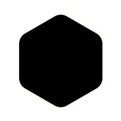
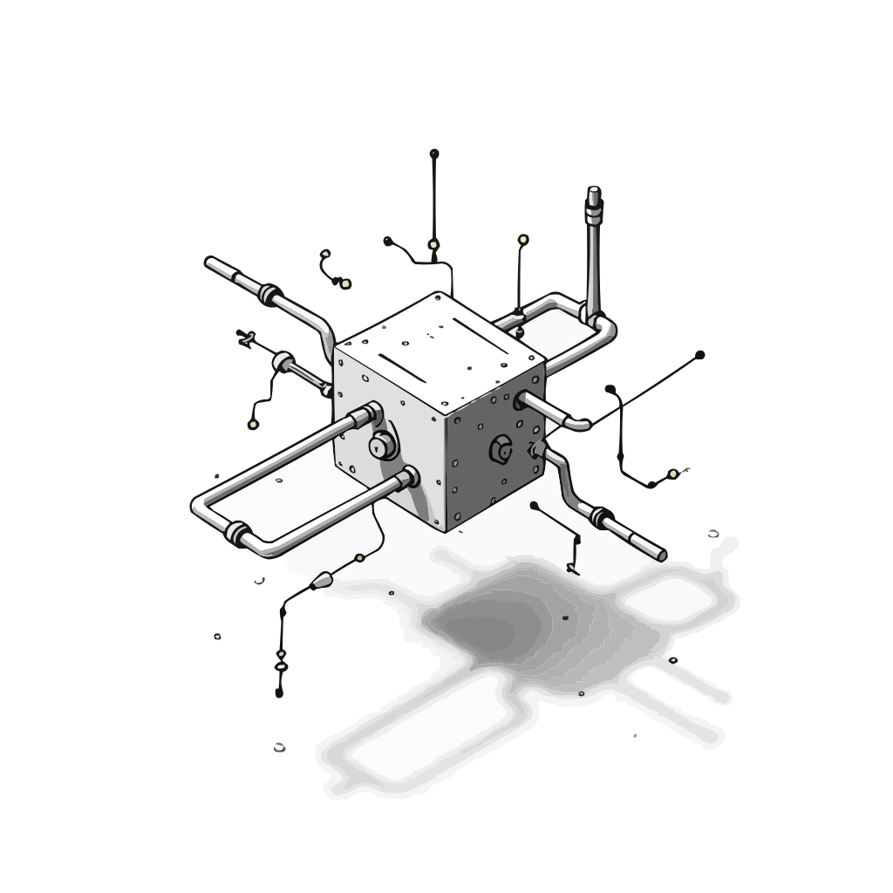

<zine-page class='left'>
  <page-num>
    8
  </page-num>
  <table class='contents-centered' style='margin-bottom: 0; margin-top: 0;'>
    <tr>
      <td>
        <small-splash-left></small-splash-left>
      </td>
      <td>
        <h2 class='lean'>
          Your Readership is Appreciated !!
        </h2>
      </td>
      <td>
        <small-splash-right></small-splash-right>
      </td>
    </tr>
  </table>
  

    And we extend further gratitude to the following sources:
  

  <table class='contents-centered'>
    <tr style='margin: auto 0;'>
      <td
        class='lean seamless'
        colspan='3'
        style='font-size: .72cm; letter-spacing: -.32cm; opacity: .4; transform: translate(-1.2%);'
        >
        ～～～～～～～～～～～～～～～～～
      </td>
    </tr>
    <tr class='lean'>
      <td
        class='lean seamless'
        style='font-size: .72cm; letter-spacing: -.32cm; opacity: .4; transform: rotate(-90deg) translate(-12%);'
        >
        〜〜〜〜
      </td>
      <td class='lean seamless'>
        
        

          ZeroSync
           
          https://zerosync.org
        

      </td>
      <td
        class='lean seamless'
        style='font-size: .72cm; letter-spacing: -.32cm; opacity: .4; transform: rotate(-90deg) translate(-12%);'
        >
        〜〜〜〜
      </td>
    </tr>
    <tr class='lean'>
      <td
        class='lean seamless'
        colspan='3'
        style='font-size: .72cm; letter-spacing: -.32cm; opacity: .4; transform: translate(-1.2%);'
        >
        ～～～～～～～～～～～～～～～～～
      </td>
    </tr>
  </table>
  <table class='contents-centered'>
    <tr style='margin: auto 0;'>
      <td
        class='lean seamless'
        colspan='3'
        style='font-size: .72cm; letter-spacing: -.32cm; opacity: .4; transform: translate(-1.2%);'
        >
        ～～～～～～～～～～～～～～～～～
      </td>
    </tr>
    <tr class='lean'>
      <td
        class='lean seamless'
        style='font-size: .72cm; letter-spacing: -.32cm; opacity: .4; transform: rotate(-90deg) translate(-12%);'
        >
        〜〜〜〜
      </td>
      <td class='lean seamless'>
        
        

          Bitcoin Optech
           
          https://bitcoinops.org
        

      </td>
      <td
        class='lean seamless'
        style='font-size: .72cm; letter-spacing: -.32cm; opacity: .4; transform: rotate(-90deg) translate(-12%);'
        >
        〜〜〜〜
      </td>
    </tr>
    <tr class='lean'>
      <td
        class='lean seamless'
        colspan='3'
        style='font-size: .72cm; letter-spacing: -.32cm; opacity: .4; transform: translate(-1.2%);'
        >
        ～～～～～～～～～～～～～～～～～
      </td>
    </tr>
  </table>
  <table class='contents-centered'>
    <tr style='margin: auto 0;'>
      <td
        class='lean seamless'
        colspan='3'
        style='font-size: .72cm; letter-spacing: -.32cm; opacity: .4; transform: translate(-1.2%);'
        >
        ～～～～～～～～～～～～～～～～～～
      </td>
    </tr>
    <tr class='lean'>
      <td
        class='lean seamless'
        style='font-size: .72cm; letter-spacing: -.32cm; opacity: .4; transform: rotate(-90deg) translate(-12%);'
        >
        〜〜〜〜
      </td>
      <td class='lean seamless'>
        
        

          Shielded Client-Side Validation
           
          github: ShieldedCSV/ShieldedCSV
        

      </td>
      <td
        class='lean seamless'
        style='font-size: .72cm; letter-spacing: -.32cm; opacity: .4; transform: rotate(-90deg) translate(-12%);'
        >
        〜〜〜〜
      </td>
    </tr>
    <tr class='lean'>
      <td
        class='lean seamless'
        colspan='3'
        style='font-size: .72cm; letter-spacing: -.32cm; opacity: .4; transform: translate(-1.2%);'
        >
        ～～～～～～～～～～～～～～～～～～
      </td>
    </tr>
  </table>
  <table class='contents-centered'>
    <tr style='margin: auto 0;'>
      <td
        class='lean seamless'
        colspan='3'
        style='font-size: .72cm; letter-spacing: -.32cm; opacity: .4; transform: translate(-1.2%);'
        >
        ～～～～～～～～～～～～～～～～～～
      </td>
    </tr>
    <tr class='lean'>
      <td
        class='lean seamless'
        style='font-size: .72cm; letter-spacing: -.32cm; opacity: .4; transform: rotate(-90deg) translate(-12%);'
        >
        〜〜〜〜
      </td>
      <td class='lean seamless'>
        
        

          Awesome BitVM
           
          github: Rsync25/awesome-bitvm
        

      </td>
      <td
        class='lean seamless'
        style='font-size: .72cm; letter-spacing: -.32cm; opacity: .4; transform: rotate(-90deg) translate(-12%);'
        >
        〜〜〜〜
      </td>
    </tr>
    <tr class='lean'>
      <td
        class='lean seamless'
        colspan='3'
        style='font-size: .72cm; letter-spacing: -.32cm; opacity: .4; transform: translate(-1.2%);'
        >
        ～～～～～～～～～～～～～～～～～～
      </td>
    </tr>
  </table>
  <table class='contents-centered'>
    <tr style='margin: auto 0;'>
      <td
        class='lean seamless'
        colspan='3'
        style='font-size: .72cm; letter-spacing: -.32cm; opacity: .4; transform: translate(-1.2%);'
        >
        ～～～～～～～～～～～～～～～～～～
      </td>
    </tr>
    <tr class='lean'>
      <td
        class='lean seamless'
        style='font-size: .72cm; letter-spacing: -.32cm; opacity: .4; transform: rotate(-90deg) translate(-12%);'
        >
        〜〜〜〜
      </td>
      <td class='lean seamless'>
        
        

          Tyler Whittle's Primer
           
          github: twhit223/bitvm_primer
        

      </td>
      <td
        class='lean seamless'
        style='font-size: .72cm; letter-spacing: -.32cm; opacity: .4; transform: rotate(-90deg) translate(-12%);'
        >
        〜〜〜〜
      </td>
    </tr>
    <tr class='lean'>
      <td
        class='lean seamless'
        colspan='3'
        style='font-size: .72cm; letter-spacing: -.32cm; opacity: .4; transform: translate(-1.2%);'
        >
        ～～～～～～～～～～～～～～～～～～
      </td>
    </tr>
  </table>
</zine-page>

<zine-page class='right'>
  
  
   
   
   
   
   
   
   
   
   
   
   
   
   
   
   
   
   
   
   
  Demystify <bitcoin></bitcoin>'s Latest
  

  one ought to know
   
  without the hype
</zine-page>

<zine-page class='left'>
  <page-num>
    6
  </page-num>
  <h2 style='margin-bottom: 0; padding-bottom: 0;'>
    To Infinity and Beyond !!
  </h2>
  
  

    "BitVM unlocks any computation on 
     
    <bitcoin></bitcoin> without changing its core
     
    using NAND gates & challenges"
  

  
  

    <strong>
      "Don't push spams to my nod..."
    </strong>
  

  

    Rather than executing computations on <bitcoin></bitcoin>, they are merely
    <strong>
      verified
    </strong>,
    similar to
    <underline>
      optimistic rollups.
    </underline>
  

  <h4 class='lean'>
    Avoiding your Neighbor's Arbitrary Long Compute
  </h4>
  

    ~100 opcodes on <bitcoin></bitcoin>'s Script restricts the expressiveness
    of Smart Contracts until now. If someone runs a program so big, it stuns
    all running nodes, <bitcoin></bitcoin>'s decentralization gets compromised.
  

  

    Rollups give us the best of both worlds. Bitcoiners can
    <underline>
      Compute Anything
    </underline>
    by committing a large program in a Taproot address with minimal
    footprint and no extra burden on the network.
  

</zine-page>

<zine-page class='right'>
  <page-num>
    3
  </page-num>
  <table class='contents-centered'>
    <tr>
      <td>
        <small-splash-left></small-splash-left>
      </td>
      <td>
        

          But first,
          <strong>
            Covenants
          </strong>
        

      </td>
      <td>
        <small-splash-right></small-splash-right>
      </td>
    </tr>
  </table>
  <table class='contents-centered'>
    <tr class='lean'>
      <td
        class='lean seamless'
        colspan='3'
        style='
          font-size: .48cm; letter-spacing: -.18cm; opacity: .6; transform: translate(-1%, 50%);
        '>
        ～～～～～～～～～～～～～～～～～～～～～～～～～
      </td>
    </tr>
    <tr style='margin: auto 0;'>
      <td
        class='lean seamless'
        style='
          font-size: .84cm; letter-spacing: -.32cm; opacity: .4; transform: rotate(90deg) translate(-8%); white-space: nowrap;
        '>
        ～～～～～
      </td>
      <td class='lean seamless text-center text-small text-squeezed'>
        Covenants are a category of proposed changes to <bitcoin></bitcoin>'s
        consensus rules that would allow a script to prevent an authorized spender
        from spending to certain other scripts.
      </td>
      <td
        class='lean seamless'
        style='
          font-size: .84cm; letter-spacing: -.32cm; opacity: .4; transform: rotate(-90deg) translate(-8%); white-space: nowrap;
        '>
        ～～～～～
      </td>
    </tr>
    <tr class='lean'>
      <td
        class='lean seamless'
        colspan='3'
        style='
          font-size: .48cm; letter-spacing: -.18cm; opacity: .6; transform: translate(-1%, -50%);
        '>
        ～～～～～～～～～～～～～～～～～～～～～～～～～
      </td>
    </tr>
  </table>
  
   
   
   
   
   
   
   
  

    We do not yet have Covenants on <bitcoin></bitcoin>,
    but we can emulate it. Covenant emulation in BitVM2 is a workaround
    that uses a signer committee to mimic advanced spending conditions
    not natively supported by <bitcoin></bitcoin>, introducing a small
    trust assumption.
  

</zine-page>

<zine-page class='left'>
  <page-num>
    2
  </page-num>
  <h3>
    BitVM is a bridge between <bitcoin></bitcoin> and a sidesystem. 
  </h3>
  
   
   
   
   
  

    Generally, bridges are secured by a federated multisig where exit
    cannot be done unilaterally, but by approval of majority vote.
  

  <table class='contents-centered'>
    <tr>
      <td>
        <small-splash-left></small-splash-left>
      </td>
      <td>
        <h2>
          BitVM is different !!
        </h2>
      </td>
      <td>
        <small-splash-right></small-splash-right>
      </td>
    </tr>
  </table>
  

    It is a 1-of-N trust model, in which as long as you have one live
    honest operator, you can withdraw on-chain. Users can bet on one
    honest operator instead of majority honest actors per federation.
  

</zine-page>

<zine-page class='right'>
  <page-num>
    7
  </page-num>
  

    Better than allowing bloatwares on the mainchain, BitVM clears the path for
    some important works in the cypherpunk world to emerge on <bitcoin></bitcoin>
    discussions.
  

  

    Independent teams rush to create Zero-Knowledge Proof Verifier on <bitcoin></bitcoin>
    Script and Tapscript again with the workaround presented by BitVM research.
  

  <h3 class='lean'>
    Rate of Innovations
  </h3>
  <table class='seamless text-small' style='margin: 0 auto;'>
    <thead>
      <tr>
        <th class='seamless'>PROTOCOL</th>
        <th class='seamless'>PROCESSING TIME</th>
        <th class='seamless'>STORAGE</th>
        <th class='seamless'>ROUNDS</th>
      </tr>
    </thead>
    <tbody class='lean'>
      <tr class='lean'>
        <td class='lean seamless' colspan='4'>
          〰〰〰〰〰〰〰〰〰〰〰〰〰〰〰〰〰〰〰〰〰〰〰〰〰
        </td>
      </tr>
      <tr class='lean'>
        <td class='lean seamless'>
          BitVM
           
          (gate-based)
        </td>
        <td class='lean seamless'>Weeks</td>
        <td class='lean seamless'>Terabytes</td>
        <td class='lean seamless'>~ 50</td>
      </tr>
      <tr class='lean'>
        <td class='lean seamless'>BitVM</td>
        <td class='lean seamless'>Days</td>
        <td class='lean seamless'>Gigabytes</td>
        <td class='lean seamless'>~ 38</td>
      </tr>
      <tr class='lean'>
        <td class='lean seamless'>BitVM2</td>
        <td class='lean seamless'>Minutes</td>
        <td class='lean seamless'>Megabytes</td>
        <td class='lean seamless'>1</td>
      </tr>
    </tbody>
  </table>
   
  <table class='contents-centered'>
    <tr>
      <td>
        <small-splash-left></small-splash-left>
      </td>
      <td>
        and it's FOSS !!
      </td>
      <td>
        <small-splash-right></small-splash-right>
      </td>
    </tr>
  </table>
  

    In March 2025, ZeroSync completed a first proof-of-concept implementation of
    zkCoins and the BitVM alliance completed the implementation of BitVM bridges
    available under the MIT License
  

</zine-page>

<zine-page class='left'>
  <page-num>
    4
  </page-num>
  <h3 style='padding-bottom: 0; margin-bottom: 0;'>
    Why talk about Covenants when discussing BitVM ?
  </h3>
  

    Because <bitcoin></bitcoin> is the only decentralized verifier in the world.
    The network verifies proofs, signatures and transactions without prejudice.
  

  

    Design decisions under <bitcoin></bitcoin>, including Turing-incompleteness
    within scripting language, allow every node to verify scripts efficiently
    within the 1,000 stack elements and 201 opcodes trustlessly.
  

  

    Both Covenants and BitVM challenge this limit, but BitVM does it
    without requiring changes to the <bitcoin></bitcoin> protocol, (not yet),
    but with a paradigm shift.
  

  <h4>
    What can Bitcoiners do now, that they cannot before?
  </h4>
  
  
  
  
  
  
  

    Bristol
     
    Circuit
  

  

    Shielded
     
    CSV
  

  

    Proof
     
    Systems
  

  

    Compute
     
    Anything
  

  

    Covenant
     
    Lite
  

  

    Side
     
    Layers
  

</zine-page>

<zine-page class='right'>
  <page-num>
    5
  </page-num>
  <h2 style='margin-bottom: 0; padding-bottom: 0;'>
    Let's look at User-friendly Upgrades !!
  </h2>
  
  <h4 style='margin-bottom: 0; margin-left: 1.8cm;'>
    Shielded Client-Side Validation
  </h4>
  

    Transaction history is rich source of information to link transactions
  

  

    and de-anonymizing users. Client-Side validation protocols, where the coin proof
    reveals the transaction history of the coin, offer certain privacy advantages over
    transparent blockchain transactions. Senders broadcast nullifiers to Receivers
    which contain full history of the coin.
  

  

    <strong>
    Known CSV Models in the wild
    </strong>
  

  <ul class='text-left'>
    <li>
      RGB Protocol
    </li>
    <li>
      Lightning Labs' Taproot Assets
    </li>
  </ul>
  

    With Shielded CSV on BitVM paradigm, nullifier footprints can be limited to 64-byte size
    and contain only validity proof without de-anonymyzing data.
  

</zine-page>